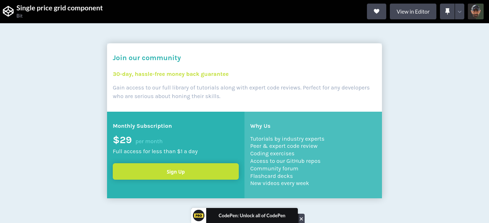

# Frontend Mentor - Single price grid component solution

This is a solution to the [Single price grid component challenge on Frontend Mentor](https://www.frontendmentor.io/challenges/single-price-grid-component-5ce41129d0ff452fec5abbbc). Frontend Mentor challenges help you improve your coding skills by building realistic projects. 

## Table of contents

- [Frontend Mentor - Single price grid component solution](#frontend-mentor---single-price-grid-component-solution)
  - [Table of contents](#table-of-contents)
  - [Overview](#overview)
    - [The challenge](#the-challenge)
    - [Screenshot](#screenshot)
    - [Links](#links)
  - [My process](#my-process)
    - [Built with](#built-with)
  - [Author](#author)

## Overview

### The challenge

Users should be able to:

- View the optimal layout for the component depending on their device's screen size
- See a hover state on desktop for the Sign Up call-to-action

### Screenshot

### Links

- Solution URL: [Solution](https://gitlab.com/bit-01/single-price-grid-component)
- Live Site URL: [Live Site](https://bit-01.gitlab.com/single-price-grid-component)

## My process

### Built with

- Semantic HTML5 markup
- CSS custom properties
- CSS Grid
- Mobile-first workflow

## Author

- Website - [Bassel Aflak](https://bit01.rf.gd)
- Frontend Mentor - [@bit-01](https://www.frontendmentor.io/profile/bibt-01)
- Gitlab - [@bit-01](https://gitlab.com/bit-01)
- Github - [@bit-01] (https://github.com/bit-01)
- Instagram - [@bit_01](https://instagram.com/bit_01)
- Codepen - [@bit-01](https://codepen.io/bit-01)